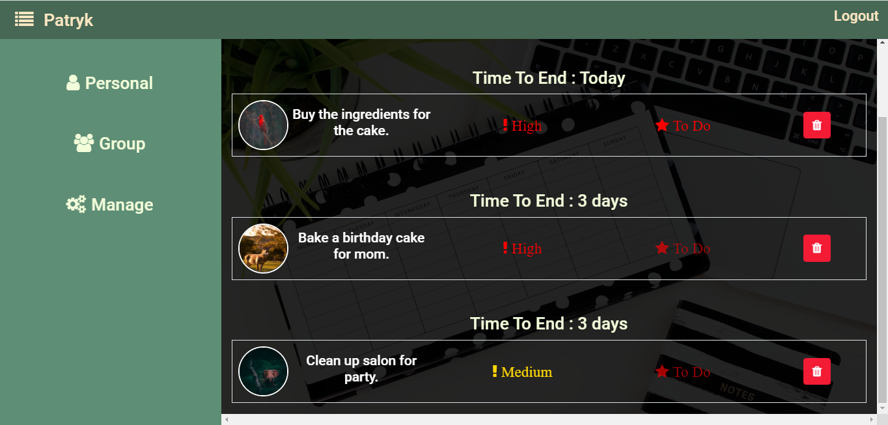

## TaskManager
My #1 project.

## Table of contents
* [General info](#general-info)
* [Screenshots](#screenshots)
* [Technologies](#technologies)
* [Setup](#setup)

## General info
Todo list with additional features.
* Create new account.
* Make personal project, or group project with possibility to add users to help.
* Send messages to other users.
* Check important projects.
* Basic operations with account (change nick/password/photo).

## Screenshots

## Technologies
* ASP.NET Core API.
* Angular.
* SQL Server.

## Setup
To run API open TaskManager.API.sln with Visual Studio,
change from IIS Express to TaskManager.API and press F5.

To run SPA open TaskManager folder with Visual Studio Code and
`cd TaskManager-SPA`
`npm install`
`ng serve`
Open http://localhost:4200
